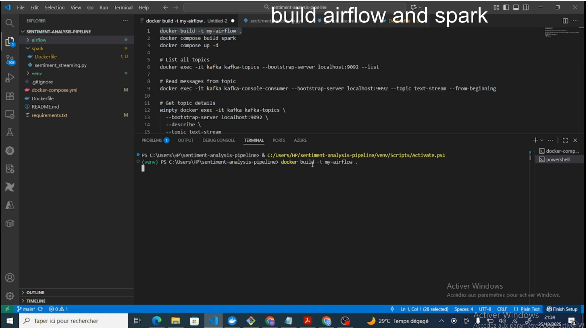

# 📊 Real-Time Sentiment Analysis Pipeline

A complete **DataOps + AI** production-ready pipeline for real-time sentiment analysis of streaming text data using modern data engineering tools and AI models.


## 🎯 Overview

This project demonstrates a complete streaming analytics pipeline that:
- **Ingests** text data from Reddit APIs 
- **Streams** data through Apache Kafka
- **Processes** in real-time using Apache Spark Streaming
- **Analyzes** sentiment using Hugging Face Transformers (DistilBERT)
- **Stores** results in Elasticsearch
- **Visualizes** insights with Kibana dashboards
- **Orchestrates** workflows with Apache Airflow

## 🏗️ Architecture


## 🔧 Configuration

###  Reddit API Setup

To use real Reddit data instead of sample data:

1. Create a Reddit app at https://www.reddit.com/prefs/apps
2. Create a `.env` file in the project root:

```bash
REDDIT_CLIENT_ID=your_client_id
REDDIT_CLIENT_SECRET=your_client_secret
REDDIT_USER_AGENT=sentiment-analysis-bot/1.0
```
[](https://drive.google.com/file/d/1fFbAhxyHGXSqBRPWZwEwxBZjoUl3PwSi/view?usp=sharing)

## 🚀 Quick Start

### Prerequisites

- Docker Desktop (with at least 6GB RAM allocated)
- Docker Compose
- Git

### Installation

```bash
# 1. Clone the repository
git clone https://github.com/PENE18/sentiment-analysis-pipeline.git
cd sentiment-analysis-pipeline

# 2. Build and start all services
docker build -t my-airflow .
docker compose build spark
docker-compose up -d

# 3. Wait 3-5 minutes for services to initialize
docker-compose ps

# 4. Access the UIs
# Airflow:      http://localhost:8080 (admin/admin)
# Kibana:       http://localhost:5601
# Elasticsearch: http://localhost:9200
```

[](https://drive.google.com/file/d/1tx9m4MD84qV8kx0_JTa8bnu2F-ifHeyX/view?usp=sharing)



### Running the Pipeline

```bash
# 1. Open Airflow UI
open http://localhost:8080

# 2. Enable and trigger a DAG
# - Toggle ON: reddit_sentiment_ingestion or twitter_sentiment_ingestion
# - Click the play button to trigger

# 3. Watch Spark process the data
docker-compose logs -f spark

# 4. View results in Kibana
open http://localhost:5601
```
[](https://drive.google.com/file/d/1xUxJkRWHowHgY4jzyxspYuLCoAp1Ae7F/view?usp=sharing)


 Restart services:
```bash
docker-compose down
docker-compose up -d
```
## 📊 Sample Output

### Spark Processing Logs
[](https://drive.google.com/file/d/1m8KZRJBBv6YexZviV_KjYsFWzpWaqM7g/view?usp=sharing)

   ──────────────────────────────────────────────────────────────────


### Kibana Dashboard Metrics
- **Sentiment Distribution**: Pie chart showing positive/negative/neutral breakdown
- **Source Analysis**: Bar chart by platform (Reddit/Twitter/Sample)
- **Top Keywords**: Word cloud of most common terms

[](https://drive.google.com/file/d/1isHvlaul4CSketCUYLksRhJToRnuKujY/view?usp=sharing)
  

## 🔍 Monitoring

### View Logs

```bash
# All services
docker-compose logs -f

# Specific service
docker-compose logs -f spark
docker-compose logs -f airflow
docker-compose logs -f kafka

# Last 100 lines
docker-compose logs --tail=100 spark
```

### Check Service Health

```bash
# Container status
docker-compose ps

# Elasticsearch health
curl http://localhost:9200/_cluster/health?pretty

# Kafka topics
docker exec -it kafka kafka-topics --bootstrap-server localhost:9092 --list

# Count indexed documents
curl http://localhost:9200/sentiment-analysis/_count?pretty
```

## 🛑 Management Commands

```bash
# Stop all services
docker-compose down

# Stop and remove all data
docker-compose down -v

# Restart specific service
docker-compose restart spark

# Rebuild after code changes
docker-compose up -d --build

# View resource usage
docker stats
```

## 📈 Performance

- **Throughput**: ~100 messages/second
- **Latency**: <2 seconds end-to-end
- **Model Load Time**: ~2 minutes (first run only)
- **Memory Usage**: ~4GB total
- **CPU Usage**: 2-4 cores recommended

## 🐛 Troubleshooting

### Services won't start
```bash
# Check Docker resources (need 6GB+ RAM)
docker info

# View error logs
docker-compose logs

# Complete reset
docker-compose down -v
docker-compose up -d --build
```

### Spark not processing data
```bash
# Check if Kafka has messages
docker exec -it kafka kafka-console-consumer \
  --bootstrap-server localhost:9092 \
  --topic text-stream \
  --from-beginning \
  --max-messages 5

# Restart Spark
docker-compose restart spark
```

### Airflow DAG not showing
```bash
# Check for errors
docker-compose logs airflow | grep ERROR
```
## 🛠️ Tech Stack

| Component | Technology | Purpose |
|-----------|-----------|---------|
| **Orchestration** | Apache Airflow 2.8.4 | Workflow scheduling and monitoring |
| **Streaming** | Apache Kafka 7.5.0 | Real-time message broker |
| **Processing** | Apache Spark 3.5.0 | Distributed stream processing |
| **AI/ML** | Hugging Face Transformers | Sentiment classification (DistilBERT) |
| **Storage** | Elasticsearch 8.11.0 | Document store and search engine |
| **Visualization** | Kibana 8.11.0 | Interactive dashboards |
| **Containerization** | Docker & Docker Compose | Portable deployment |
| **Language** | Python 3.10 | Pipeline implementation |

## ✨ Features

- ✅ **Fully Dockerized** - No complex local setup required
- ✅ **Real-time Processing** - Analyze data as it arrives
- ✅ **AI-Powered** - State-of-the-art sentiment classification
- ✅ **Production Ready** - Includes error handling, logging, and monitoring
- ✅ **Scalable** - Easy to add more workers and partitions
- ✅ **API Integration** - Supports Reddit and Twitter APIs
- ✅ **Sample Data** - Works out-of-the-box without API keys
- ✅ **Interactive Dashboards** - Real-time visualization with Kibana


## 📚 Learning Resources

- [Apache Kafka Documentation](https://kafka.apache.org/documentation/)
- [Apache Spark Streaming Guide](https://spark.apache.org/docs/latest/streaming-programming-guide.html)
- [Hugging Face Transformers](https://huggingface.co/docs/transformers)
- [Elasticsearch Guide](https://www.elastic.co/guide/en/elasticsearch/reference/current/index.html)
- [Apache Airflow Documentation](https://airflow.apache.org/docs/)

## 🤝 Contributing

Contributions are welcome! Please feel free to submit a Pull Request.

1. Fork the repository
2. Create your feature branch (`git checkout -b feature/AmazingFeature`)
3. Commit your changes (`git commit -m 'Add some AmazingFeature'`)
4. Push to the branch (`git push origin feature/AmazingFeature`)
5. Open a Pull Request

## 📄 License

This project is licensed under the MIT License - see the [LICENSE](LICENSE) file for details.

## 👨‍💻 Author

**Your Name**
- GitHub: [@PEN18](https://github.com/PENE18)
- LinkedIn: [mamadoupene495](https://www.linkedin.com/in/mamadoupene495/)

## 🙏 Acknowledgments

- [Hugging Face](https://huggingface.co/) for pre-trained models
- [Apache Software Foundation](https://apache.org/) for Kafka, Spark, and Airflow
- [Elastic](https://www.elastic.co/) for Elasticsearch and Kibana
- The open-source community

## ⭐ Star History

If you find this project useful, please consider giving it a star! ⭐

---


